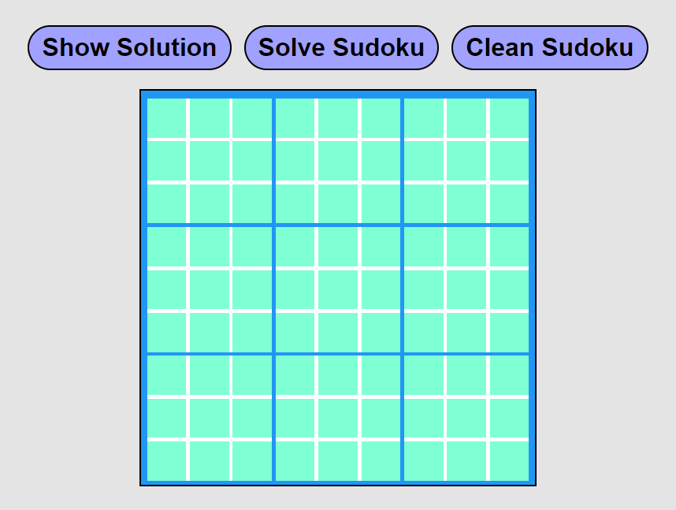
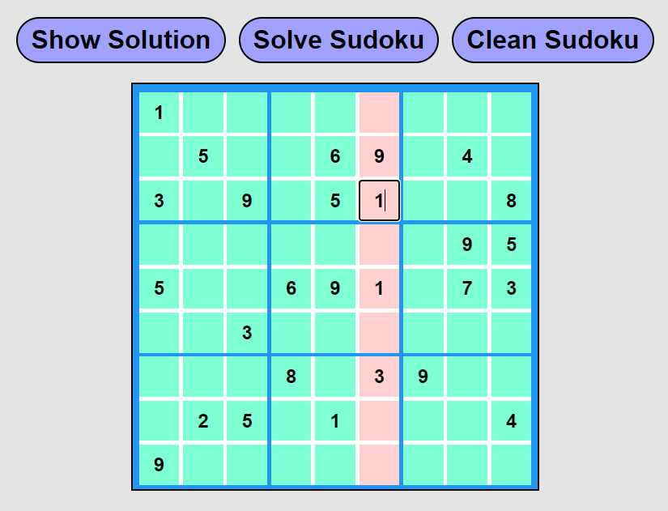
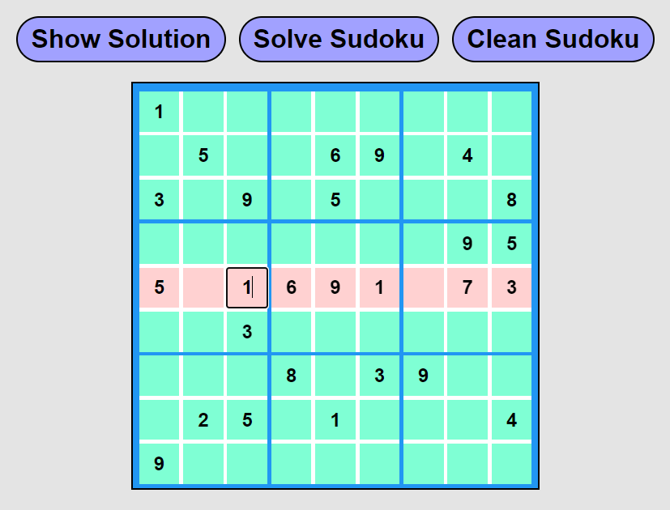
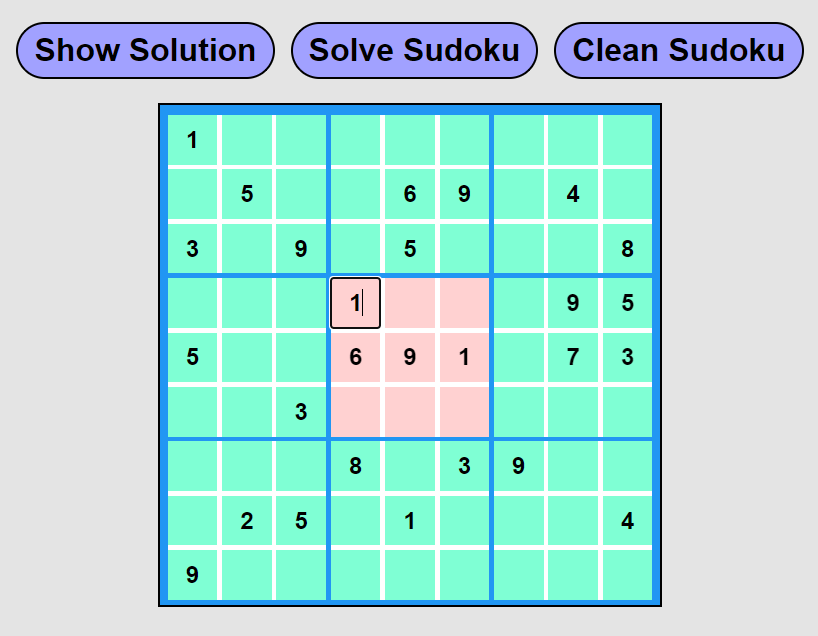
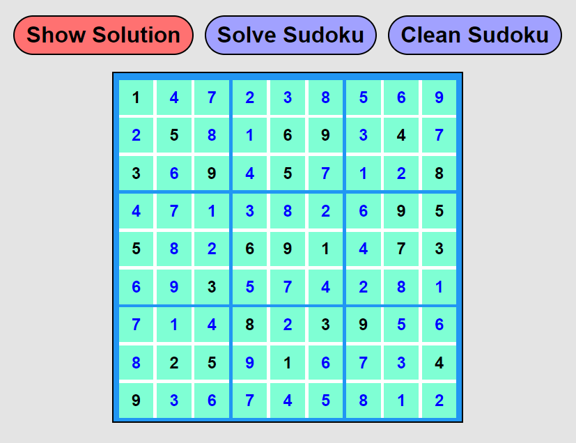
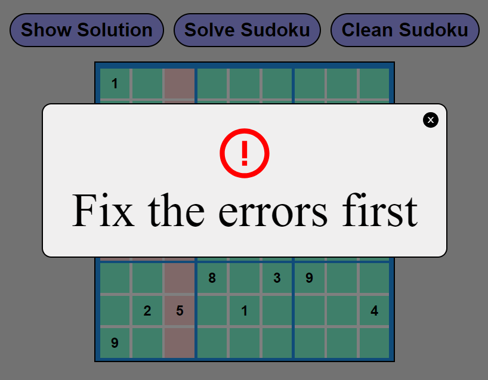

# Getting Started with the App!

Once the folder has been downloaded, proceed to access to the command promt to  install all the corresponding libraries and dependencies using:

```npm install```

After installing, proceed to start the program using:

```npm start```

**And now you can start solving sudokus!!**




### -> Help when solving sudokus

When you try to solve the sudoku, it can be seen when the user enters repeated numbers in a box, in a row or a column, since they will be highlighted in red as shown in the image below






### -> Show the solution

If you need extra help, it is possible to preview the sudoku solution by clicking "Show Solution". You can later remove the option by clicking it again.




### -> Solve de puzzle

There is also the option to simply display the sudoku solution by clicking the "Solve Sudoku" option.

It is important to fix all errors before displaying any solutions, otherwise the following message will appear




### -> Clean all

Finally you can press the "Clean" option to restart the Sudoku and erase all the information, so that you can start again.
